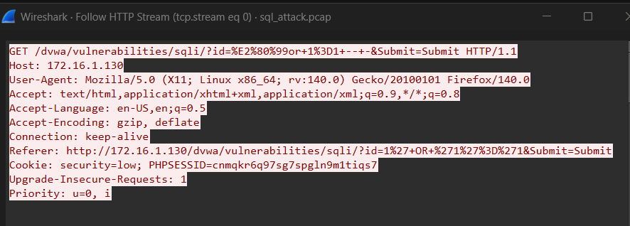
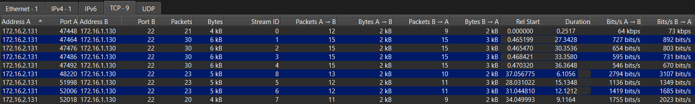
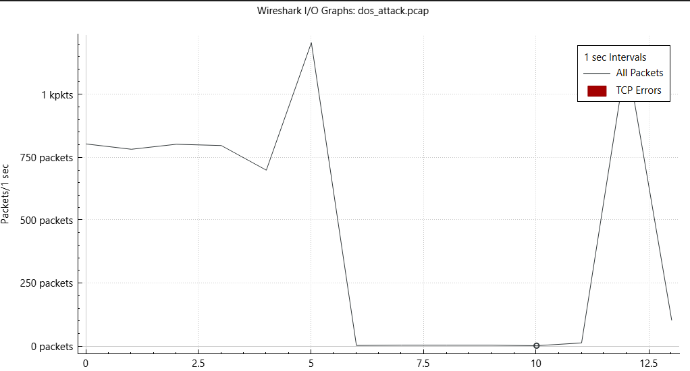

# 🛡️ Hệ thống Giám sát SOC với Security Onion

Dự án này mô phỏng môi trường SOC thực chiến, tập trung vào việc phát hiện và phân tích các cuộc tấn công mạng phổ biến.

## 📂 Danh sách bằng chứng (PCAPs)
Tất cả traffic tấn công được lưu trữ tại thư mục `/pcaps` để phục vụ điều tra số (Forensics).

### 1. SQL Injection Detection
- **Mô tả:** Kẻ tấn công cố gắng vượt qua cơ chế đăng nhập của DVWA.
- **Phân tích:** Dựa trên file `sql_attack.pcap`, ta thấy rõ Payload mã độc trong HTTP Header.

### 2. SSH Brute Force
- **Mô tả:** Tấn công dò tìm mật khẩu cổng 22.
- **Phân tích:** Thống kê TCP Conversations cho thấy hàng loạt kết nối thất bại từ IP kẻ tấn công.

### 3. DoS Attack (UDP Flood)
- **Mô tả:** Làm cạn kiệt băng thông máy nạn nhân.
- **Phân tích:** Biểu đồ I/O Graph cho thấy lưu lượng đạt đỉnh > 1000 packets/s.
 

## 🛡️ Phương án xử lý (Mitigation)
Sử dụng script `block_attacker.sh` để tự động chặn IP kẻ tấn công thông qua Iptables.
