# 🛡️ Security Onion SOC Lab: Inline Monitoring & Incident Response

## 1. Khái quát (Overview)
Dự án tập trung xây dựng mô hình **SOC (Security Operations Center)** thực tế nhằm giám sát, phát hiện và phản ứng trước các kịch bản tấn công mạng phổ biến.

* **Kiến trúc:** **Inline Monitoring** (Giám sát trực tiếp). Security Onion đóng vai trò là "chốt chặn" trung tâm, buộc mọi lưu lượng từ kẻ tấn công phải đi qua hệ thống kiểm soát trước khi đến đích.
* **Giá trị cốt lõi:** Thực thi quy trình **IR (Incident Response)** chuẩn hóa từ bước nhận diện dấu hiệu cho đến khi củng cố hệ thống (Hardening).

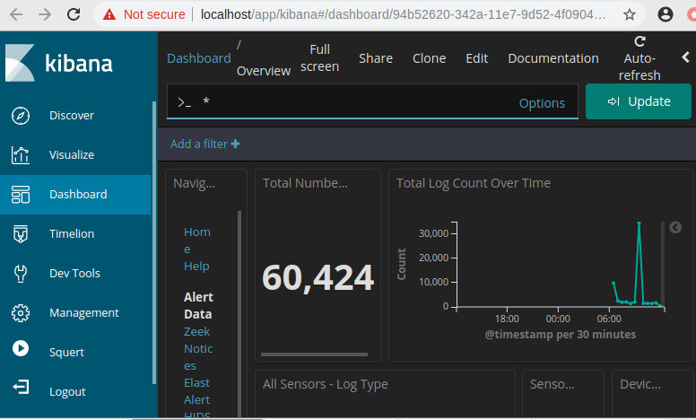

---

## 2. Kỹ thuật sơ bộ (Technical Specifications)

### 🖥️ Danh sách máy ảo
* **Attacker:** Kali Linux (172.16.1.131)
* **Monitor/IPS:** Security Onion (172.16.1.134) - Chạy IDS/IPS, Wazuh Manager.
* **Victim:** Windows 7 (172.16.1.130) - Cài đặt Wazuh Agent & Bitvise SSH.

### 🌐 Sơ đồ kết nối
| Kết nối | Giao diện mạng | Ghi chú |
| :--- | :--- | :--- |
| Kali → SecOnion | VMnet2 | Phân đoạn tấn công (Attack Segment) |
| SecOnion → Win7 | VMnet8 | Phân đoạn nạn nhân (Victim Segment) |

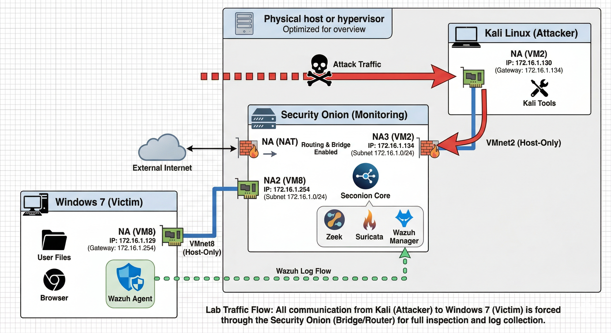

---

## 3. Kịch bản tấn công (Attack Scenarios)
Mô phỏng các kỹ thuật tấn công thực tế từ máy Kali (Attacker) nhắm vào Windows 7 (Victim).

### 3.1. SSH Brute Force
Sử dụng `xHydra` để dò tìm mật khẩu. Hệ thống ghi nhận hàng loạt nỗ lực login thất bại trước khi tìm thấy password đúng.
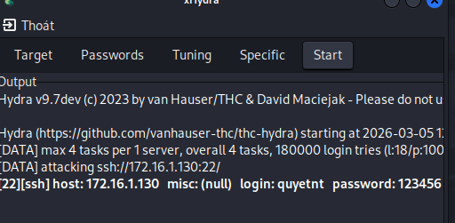

### 3.2. Malware Reverse Shell
Tạo mã độc bằng `msfvenom`, lừa nạn nhân thực thi file `malware.exe` trên máy Win7 để thiết lập kết nối ngược về Kali.
| Chạy Malware trên Win7 | Session Meterpreter thiết lập |
| :--- | :--- |
| 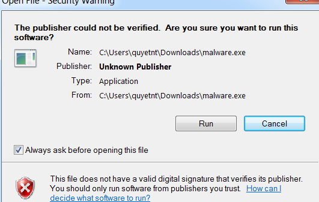 | 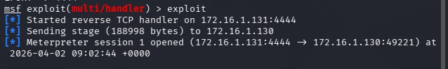 |

### 3.3. UDP Flood (DDoS)
Chạy script `UDPFloodattack.py` trên Kali đẩy lưu lượng UDP cực lớn, làm cạn kiệt tài nguyên máy nạn nhân.


### 3.4. SQL Injection
Sử dụng payload `' or 1=1 -- -` trực tiếp trên trình duyệt máy Kali để vượt qua cơ chế xác thực của ứng dụng web DVWA.
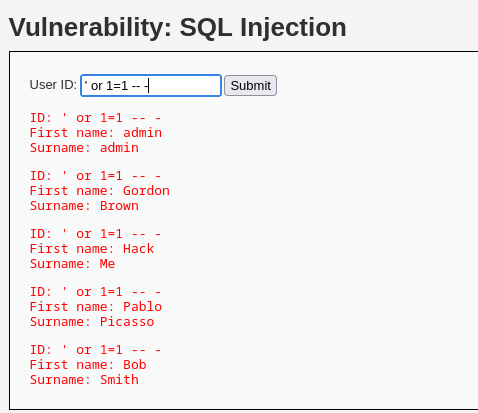

---

## 4. Quy trình ứng phó sự cố (Incident Response)

### Giai đoạn 1: Phát hiện & Xác minh (Detection)
Sử dụng mô hình đối chiếu giữa Cảnh báo IDS (Squert) và Chứng cứ thực tế (Logs/Performance).

| Loại tấn công | Cảnh báo hệ thống (Squert/IDS) | Chứng cứ thực tế (Logs/Metrics) |
| :--- | :--- | :--- |
| **SSH Brute Force** | 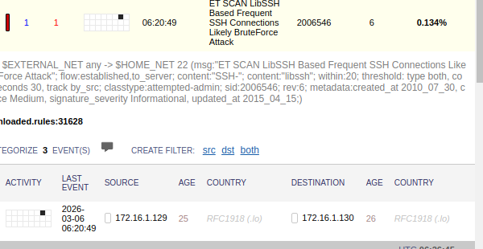 | 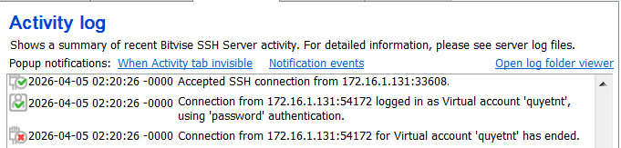 |
| **DDoS Attack** | 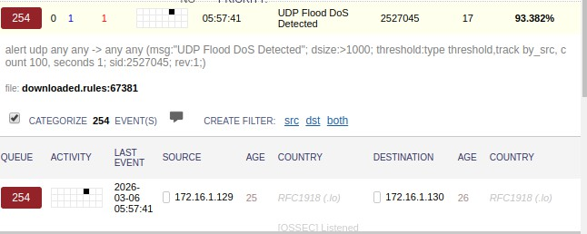 | 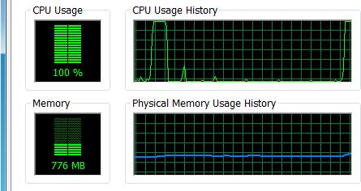 |
| **SQL Injection** | 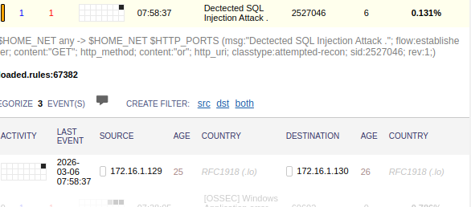 | 
| **Malware Shell** | 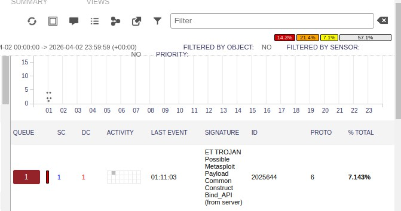 | 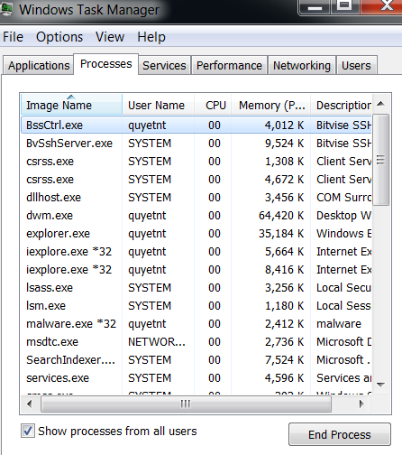 |

---

### Giai đoạn 2: Xử lý & Ngăn chặn (Containment & Eradication)

#### 🛡️ Đối với SSH & Malware
1. **Block IP:** Chặn IP kẻ tấn công tại Gateway SecOnion. 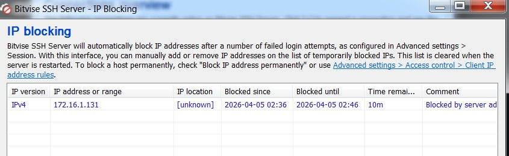
2. **Disable User:** Vô hiệu hóa tạm thời tài khoản quyetnt. 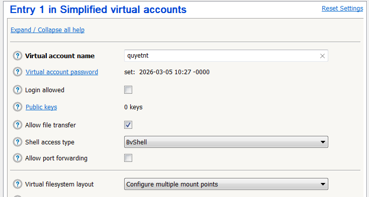 
3. **Eradication:** Truy tìm PID qua Resource Monitor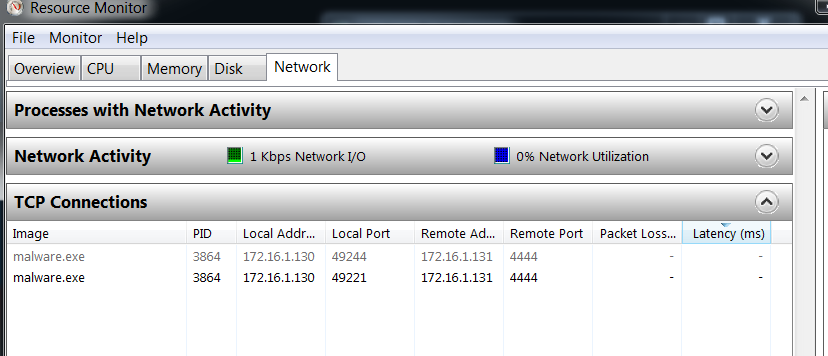 

"Kill" tiến trình malware

  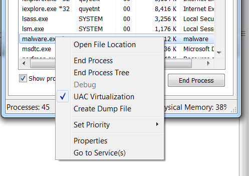

"Delete file" malware.exe vĩnh viễn.
    
  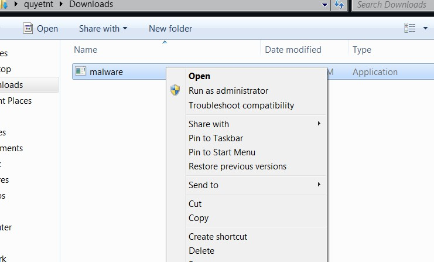
  
4. **Hardening:**

Thiết lập chính sách mật khẩu.

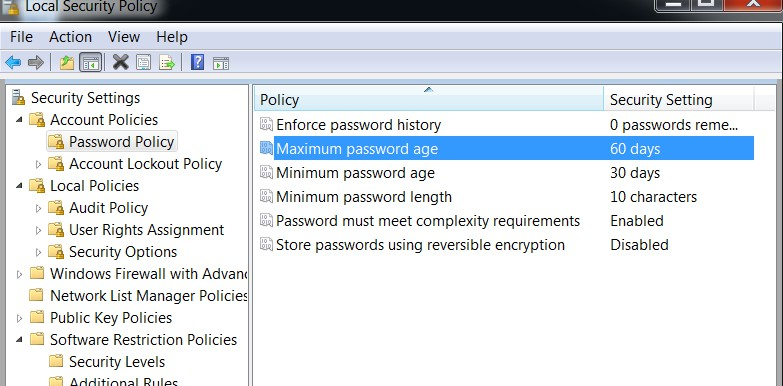

Thiết lập chính sách khóa tài khoản. 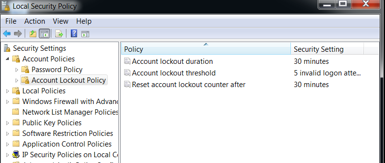

Thiết lập chính sách tường lửa và giới hạn IP. 

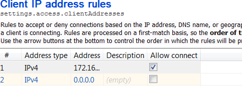

Thiết lập chính sách giám sát và kiểm tra. 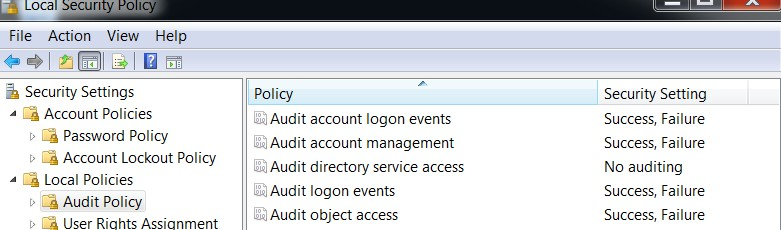 

Củng cố dịch vụ SSH. 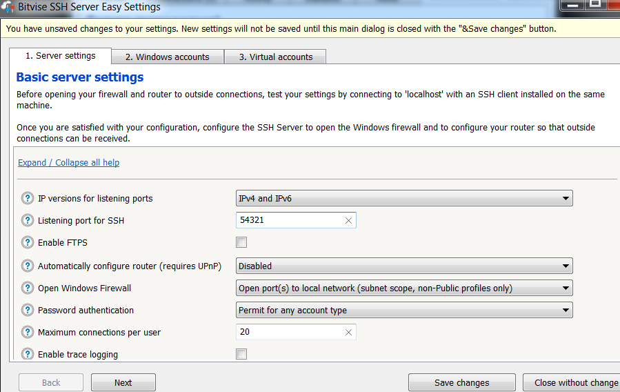

Software Restriction Policies (SRP) để chặn file lạ. 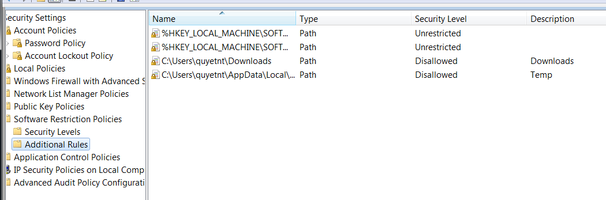 

#### 🌊 Đối với DDoS (Iptables Mitigation)
Sử dụng Firewall: Windows Firewall with Advanced Security
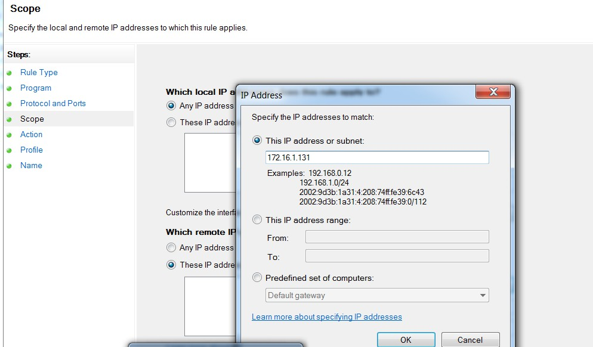
Sử dụng Iptables:
Triển khai 3 kỹ thuật lọc lưu lượng chuyên sâu trên Iptables:
```bash
# 1. Giới hạn tốc độ gói tin (Rate Limiting)
sudo iptables -A FORWARD -p udp --dport 80 -m limit --limit 10/s -j ACCEPT
```
Seconion CLI:
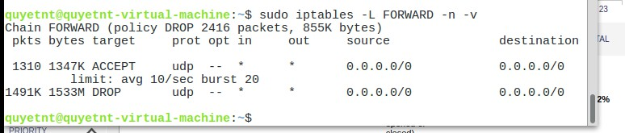
```bash
# 2. Giới hạn số lượng kết nối đồng thời (Conn-limit)
sudo iptables -A FORWARD -p tcp --syn -m connlimit --connlimit-above 5 -j DROP
```
Seconion CLI:
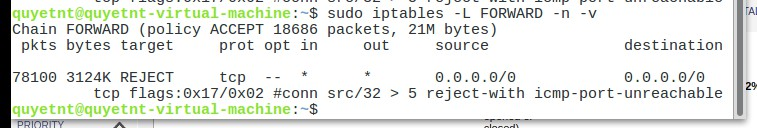
```bash
# 3. Phân tích hành vi (L7 String Matching) - Chặn gói tin chứa chuỗi độc hại
sudo iptables -I FORWARD -m string --string "malicious_payload" --algo bm -j DROP
```
Seconion CLI:
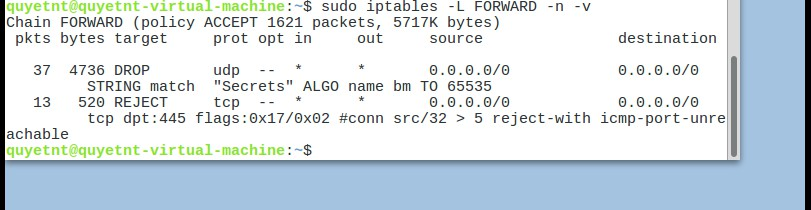

*Kết quả: CPU máy nạn nhân phục hồi về mức ổn định <5%.*

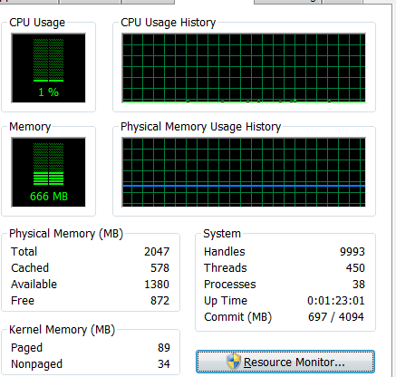

#### 💉 Đối với SQL Injection
1. **Block IP:** Sử dụng Iptables:
```bash
sudo iptables -I FORWARD -s 172.16.2.131 -j DROP
```

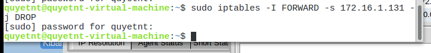

2. **Deep Packet Inspection:** Sử dụng **Sguil** đọc Transcript.

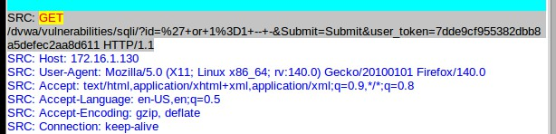

Giải mã(Decode) Payload gốc.

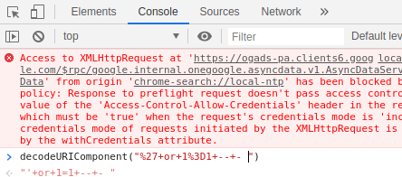

3. **Hardening:** Nâng cấp Security Level của DVWA lên mức **Impossible**.
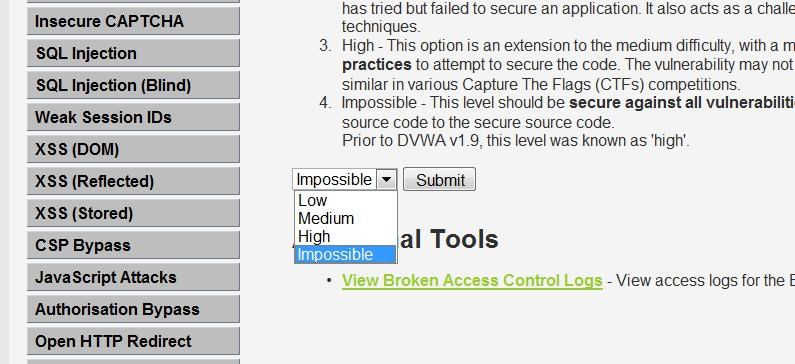

---

## 🚀 Key Skills Gained
* SOC Analyst Mindset (Detection -> Analysis -> Response).
* Advanced Iptables Filtering & System Hardening (SRP, GPO).
* Traffic Forensics with Sguil & Wireshark.

---
🛠️ **Tools:** Security Onion 2, Wazuh, Suricata, Kali Linux, xHydra, Metasploit.
